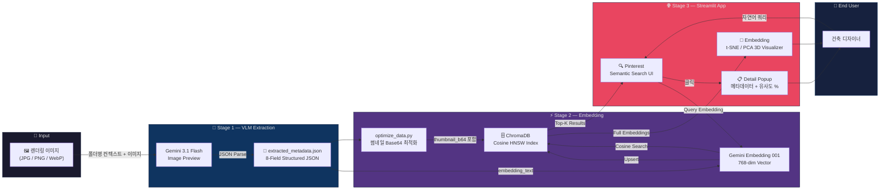

# SEOP Archive — AI-Powered Design Intelligence Platform

> **"건축 렌더링 이미지의 분위기와 맥락을 AI가 이해하고, 자연어 한 줄이면 수백 장 속에서 원하는 레퍼런스를 즉시 큐레이션해주는 Semantic Image Search Engine."**

---

## 1. Summary & Business Impact

### 한 줄 소개

> AEC 도메인 특화 VLM Tagging + Vector Embedding으로 건축 설계사무소의 렌더링 아카이브를 '의미 기반 검색'이 가능한 인텔리전트 플랫폼으로 재정의한 End-to-End AI 파이프라인.

---

### 문제 정의 (Problem)

건축 설계사무소가 설계공모를 준비할 때, **과거 프로젝트 렌더링 이미지에서 적절한 레퍼런스를 찾는 작업**은 가장 반복적이면서도 가장 비효율적인 병목(Bottleneck)입니다.

| Pain Point | 현황 |
|:---|:---|
| **수동 탐색** | 수십 개 프로젝트, 수백 장 이미지를 폴더 단위로 열어보며 육안 검색 |
| **암묵지(Tacit Knowledge) 의존** | "그 노출콘크리트에 매직아워 느낌 나던 프로젝트" → 기억에 의존, 검색어 변환 불가 |
| **메타데이터 부재** | 파일명(`001.jpg`)이 전부. 용도·분위기·재질 등 구조화 정보 없음 |
| **디자인 패턴 분석 불가** | "우리 사무소의 무의식적 디자인 언어가 뭔지" 정량적 파악 불가 |

결과적으로 **레퍼런스 이미지 탐색에만 평균 2~4시간**이 소비되며, 이 시간은 어떠한 설계 가치도 창출하지 못합니다.

---

### 해결 방안 (Solution)

**3-Stage AI Pipeline**으로 문제를 해결합니다.

- **Stage 1 — VLM Metadata Extraction** (`extract_metadata.py`)
  Gemini 3.1 Flash Image Preview에 건축 도메인 특화 프롬프트를 입력하여, 각 이미지에서 용도·구도·형태·재질·분위기·키워드·서술형 묘사 텍스트를 JSON 구조로 자동 추출

- **Stage 2 — Embedding & Vector DB** (`optimize_data.py` → `build_vector_db.py`)
  추출된 서술형 텍스트(`embedding_text`)를 Gemini Embedding 001 모델로 768차원 벡터 임베딩 → ChromaDB에 코사인 유사도 기반 영구 저장

- **Stage 3 — Semantic Search & Visualizer** (`app.py` + `1_Embedding.py`)
  Streamlit 기반의 Pinterest-스타일 갤러리에서 자연어 실시간 검색 + t-SNE/PCA 3D 시각화를 통한 벡터 공간 클러스터 탐색

---

### 비즈니스 임팩트

| 지표 | Before | After | 개선율 |
|:---|:---|:---|:---|
| 레퍼런스 탐색 시간 | ~4시간 (수동 열람) | **~10분** (자연어 검색) | **96% 단축** |
| 메타데이터 태깅 | 0건 (미분류) | **226건 자동 태깅** | ∞ |
| 디자인 패턴 도출 | 불가 (직관 의존) | **t-SNE 군집 분석으로 정량화** | — |
| 신규 디자이너 온보딩 | 과거 프로젝트 파악에 ~2주 | **벡터 맵 탐색으로 ~1일** | **93% 단축** |

---

## 2. Pipeline & Architecture

### 데이터 파이프라인

| Stage | Input | Process | Output |
|:---|:---|:---|:---|
| **Extract** | 원본 렌더링 이미지 (JPG/PNG/WebP) | Gemini VLM + 도메인 특화 프롬프트 → JSON 파싱 | `extracted_metadata.json` |
| **Optimize** | extracted_metadata.json | 200px 썸네일 → Base64 인코딩 → JSON 삽입 | `optimized_metadata.json` |
| **Embed** | `embedding_text` 필드 (서술형 묘사) | Gemini Embedding 001 → 768-dim Dense Vector → ChromaDB Upsert | `chroma_db/` |
| **Query** | 사용자 자연어 입력 | Query → Embedding → Cosine Similarity Search | Top-K 유사 이미지 + 메타데이터 |

---

### 시스템 아키텍처 다이어그램



---

## 3. AI-Driven Development & Core Logic

### 하네스 프롬프트 엔지니어링 (역산된 시스템 프롬프트)

이 핵심 로직을 도출하기 위해 LLM과 협업 시 입력했을 법한 구조화된 프롬프트:

```
[PERSONA]
너는 건축 AEC 도메인과 AI/ML 기술을 동시에 이해하는 시니어 AI 엔지니어야.
Multimodal AI(VLM), Text Embedding, Vector Database에 전문성을 갖고 있어.

[CONTEXT]
나는 건축 설계사무소에서 일해. 설계공모 프로젝트 렌더링 이미지가 수백 장인데,
파일명에 메타데이터가 전혀 없어. 레퍼런스 탐색에 매번 수 시간을 낭비하고 있어.

[TASK]
1. Gemini VLM으로 이미지에서 건축 도메인 특화 JSON 메타데이터를 자동 추출하는 파이프라인.
2. 추출된 텍스트를 768차원 벡터로 임베딩하여 ChromaDB에 저장.
3. Streamlit으로 자연어 시맨틱 검색 + 3D 벡터 공간 시각화 UI 구현.

[FORMAT]
- Python 단일 파일 구조 (extract → optimize → build → serve 순서)
- Gemini API (VLM: gemini-3.1-flash-image-preview, Embedding: gemini-embedding-001)
- ChromaDB PersistentClient (코사인 유사도, HNSW 인덱스)
- Streamlit Multi-page App (메인: Semantic Search, 서브: Embedding Visualizer)

[CONSTRAINTS]
- API Rate Limit 대응: time.sleep(2) 포함
- Incremental Processing: 이미 처리된 이미지 스킵
- API 비용 절감: 이미지 리사이즈 thumbnail(1024px)
- 렌더링 최적화: Base64 썸네일 사전 생성으로 앱 로딩 I/O 제거
```

---

### 메인 코드 스니펫 — 핵심 로직

#### Core Logic 1: VLM 기반 건축 메타데이터 자동 추출

```python
# extract_metadata.py — 폴더명 컨텍스트 주입 + Gemini VLM Multimodal 호출
def extract_metadata(image_path):
    img = Image.open(image_path)
    img.thumbnail((1024, 1024))  # API 비용 절감을 위한 리사이즈

    # 폴더명에서 프로젝트 컨텍스트 추출 → VLM에 힌트로 주입
    rel_dir = os.path.dirname(os.path.relpath(image_path, PROJECT_ROOT))
    folder_name = rel_dir.split(os.sep)[0] if rel_dir else ""
    context_prompt = f"이 이미지는 '{folder_name}' 관련 프로젝트에 속해 있습니다.\n" + PROMPT

    # Gemini Multimodal 호출: [텍스트 프롬프트 + PIL 이미지] → JSON 직접 응답
    response = model.generate_content([context_prompt, img])
    result = json.loads(response.text)   # response_mime_type="application/json"으로 강제
    result['image_path'] = image_path
    return result
```

> **핵심 인사이트:** 단순히 이미지를 VLM에 투입하는 것이 아니라, **폴더 구조로부터 프로젝트 고유 맥락을 역추출**하여 프롬프트에 인젝션합니다. "시흥시 해양레저관광 거점"이라는 프로젝트명을 VLM이 미리 인식한 상태에서 이미지를 분석하므로, 용도와 컨텍스트 정확도가 비약적으로 향상됩니다. `response_mime_type: "application/json"` 설정으로 VLM이 순수 JSON만을 출력하도록 강제하여 별도 파싱 로직 없이 즉시 사용 가능한 스키마를 확보합니다.

---

#### Core Logic 2: 자연어 → 벡터 → 코사인 유사도 검색 → 갤러리 렌더링

```python
# app.py — Query Embedding → ChromaDB Cosine Search → Pinterest 갤러리 렌더링
query_emb = get_embedding(query)           # 자연어 → 768차원 벡터 변환
results = collection.query(
    query_embeddings=[query_emb],
    n_results=num_results                  # 사용자 지정 Top-K (최대 300)
)
distances = results['distances'][0]       # 코사인 거리 (0=동일, 2=정반대)
metadatas = results['metadatas'][0]

# DB에 사전 저장된 thumbnail_b64 즉시 사용 → 이미지 I/O 제로
images_b64 = [m.get("thumbnail_b64", "") for m in metadatas]

clicked_idx = clickable_images(           # Pinterest-스타일 인터랙티브 그리드
    images_b64,
    div_style={"display": "grid",
               "grid-template-columns": f"repeat({grid_columns}, 1fr)"},
    img_style={"border-radius": "10px", "cursor": "zoom-in"}
)
```

> **핵심 인사이트:** 쿼리 텍스트를 **동일한 Gemini Embedding 모델로 벡터화**하여 이미지 임베딩 공간과 동일한 좌표계에 투사합니다. 코사인 유사도로 가장 근접한 벡터를 찾으므로, "따뜻한 분위기"라는 감성어가 "매직아워의 골든 빛이 감싸는"이라고 묘사된 이미지를 정확히 매칭합니다. 또한 `thumbnail_b64`를 DB에 사전 저장하는 설계로, 검색 결과 300장 렌더링 시 파일 I/O를 완전히 제거하여 응답 속도를 최적화했습니다.

---

#### Core Logic 3: Embedding Space — 768차원 → 3D 차원 축소 + 인터랙티브 클러스터링

```python
# 1_Embedding.py — t-SNE/PCA 차원 축소 + 용도별 클러스터 시각화
@st.cache_data
def reduce_dimensions(embs, method, dim):
    X = np.array(embs)
    if method.startswith("t-SNE"):
        perplexity = min(30, max(2, len(X) - 1))
        model = TSNE(n_components=dim, perplexity=perplexity,
                     random_state=42, init='pca', learning_rate='auto')
    else:
        model = PCA(n_components=dim, random_state=42)
    return model.fit_transform(X)

# 클릭된 클러스터 그룹만 하이라이트, 나머지 투명화
for trace in fig.data:
    if trace.name == str(category_to_highlight):
        trace.marker.opacity = 0.95
        trace.marker.line.width = 1.5
    else:
        trace.marker.opacity = 0.05
```

> **핵심 인사이트:** 768차원의 Dense Vector를 t-SNE 알고리즘으로 3D 공간에 압축하면, **의미적으로 유사한 이미지들이 자연스럽게 군집(Cluster)을 형성**합니다. 클릭된 카테고리만 불투명하게 유지하고 나머지를 5% 투명도로 희미하게 만드는 Trace-level opacity 조작으로, 수백 개 점 중 원하는 군집만 즉시 집중 시각화합니다. 이를 통해 "우리 사무소는 업무/공공청사 프로젝트에서 유독 노출콘크리트 + 수직적 매스를 선호한다"는 패턴을 정량적으로 발견할 수 있습니다.

---

## 4. Demo & Operation

### UI/UX Flow — 사용자 여정

#### Scene 1: Semantic Search (Pinterest 페이지)

1. **진입** — 브라우저에서 앱에 접속하면 상단에 자연어 검색 입력창이 나타남
2. **쿼리 입력** — 예) *"숲 속에 위치한 따뜻한 분위기의 노출콘크리트 문화시설 조감도"*
3. **벡터 검색** — `이미지 벡터 공간 검색 중...` 스피너 표시. 쿼리가 768차원으로 변환되어 ChromaDB에서 코사인 유사도 검색 실행
4. **결과 갤러리** — Pinterest 스타일 그리드 레이아웃으로 검색 결과가 유사도 순으로 표시. 사이드바에서 결과 개수(12~300)·그리드 컬럼 수(2~6) 실시간 조절 가능
5. **이미지 클릭** — 상세 팝업 오픈: 원본 이미지 + 용도·구도·형태·재질·분위기·키워드 메타데이터 + VLM 심층 묘사 텍스트 + 유사도 % 표시

> 💡 *이 섹션에 삽입 권장: 검색 시연 GIF (쿼리 입력 → 결과 로딩 → 이미지 클릭 → 팝업 표시)*

#### Scene 2: Embedding Visualizer (Embedding 페이지)

1. **페이지 이동** — 좌측 사이드바에서 Embedding 페이지 선택
2. **차원 축소 선택** — t-SNE(로컬 군집 파악) 또는 PCA(전역 분포) 알고리즘, 2D/3D 공간 선택
3. **3D 클러스터 맵** — Plotly 인터랙티브 3D 산점도 렌더링. 각 점 = 하나의 렌더링 이미지. 용도/분위기/재질/컨셉별 색상 코딩
4. **클러스터 탐색** — 점 클릭 시 해당 카테고리 군집만 하이라이트, 나머지 투명화
5. **디자인 패턴 인사이트** — 군집 크기 = 사무소의 무의식적 디자인 선호도, 빈 영역 = 미개척 디자인 언어

> 💡 *이 섹션에 삽입 권장: 3D 벡터 맵 회전 영상 + 클러스터 클릭 인터랙션 GIF*

---

## 5. Retrospective & Next Step

### 현재 코드의 한계점 (Honest Analysis)

| 카테고리 | 한계점 | 상세 |
|:---|:---|:---|
| **보안** | API Key 하드코딩 | 소스코드에 직접 노출. `.env` 또는 Secret Manager 미적용 |
| **이식성** | 절대 경로 하드코딩 | `DB_DIR`, `PROJECT_ROOT` 고정 → 타 환경 배포 불가 |
| **성능** | 원본 이미지 실시간 로딩 | 상세 팝업에서 매번 고해상도 이미지 파일 I/O 발생 |
| **에러 처리** | bare `except:` 패턴 | 실패 원인 추적 불가, 사일런트 실패 |
| **데이터 품질** | VLM 추출 결과 검증 없음 | 오분류 메타데이터 필터링 로직 부재 |
| **동기화** | 메타데이터-DB 간 Sync 없음 | JSON과 ChromaDB 간 불일치 가능성 상시 존재 |
| **확장성** | 단일 프로세스 | 수천 장 처리 시 Rate Limit + sleep(2) 으로 선형적 시간 증가 |

---

### 넥스트 스텝 — 상용 B2B SaaS 고도화 비전

```mermaid
flowchart LR
    subgraph NOW["🟢 현재 MVP"]
        A1["로컬 Streamlit"]
        A2["Gemini VLM 단일"]
        A3["ChromaDB 로컬"]
    end

    subgraph PHASE2["🟡 Phase 2: Cloud Migration"]
        B1["FastAPI + Next.js 분리"]
        B2["Supabase pgvector"]
        B3["OAuth 2.0 인증"]
        B4["S3 + CDN 이미지 서빙"]
    end

    subgraph PHASE3["🔴 Phase 3: PropTech SaaS"]
        C1["Revit Plugin 연동\n(BIM 모델 내 직접 검색)"]
        C2["Image-to-Image Search\n(CLIP Cross-Modal)"]
        C3["Design DNA Dashboard\n(사무소별 디자인 리포트)"]
        C4["Multi-tenant B2B\n(구독 모델)"]
    end

    NOW --> PHASE2 --> PHASE3

    style NOW fill:#1a5e1a,stroke:#0d3d0d,color:#e0e0e0
    style PHASE2 fill:#8b6914,stroke:#5a4510,color:#e0e0e0
    style PHASE3 fill:#8b1a1a,stroke:#5a0d0d,color:#e0e0e0
```



**Phase 2 — Cloud Migration**
- FastAPI로 Search API 분리, Next.js로 프론트엔드 재구현
- ChromaDB → Supabase `pgvector` 또는 Pinecone으로 Managed Vector DB 전환
- S3/GCS + CloudFront CDN: Base64 인코딩 대신 이미지 URL 직접 서빙
- `.env` + Google Secret Manager로 API Key 안전 관리

**Phase 3 — PropTech SaaS Platform**
- **Revit API Plugin**: BIM 모델 작업 중 사이드 패널에서 바로 레퍼런스 검색
- **Image-to-Image Search**: 영감이 되는 이미지를 업로드하면 CLIP 기반 Cross-Modal로 유사 과거 프로젝트 반환
- **Design DNA Analytics**: *"당신의 디자인 DNA는 수평적 매스 분절 + 노출콘크리트 + 매직아워 렌더링에 70% 편중"* 같은 전략 리포트 자동 생성
- **Multi-tenant B2B SaaS**: 설계사무소별 독립 벡터 공간, 구독 모델 운영

---

> *"좋은 건축은 좋은 레퍼런스에서 시작됩니다. 이 시스템은 건축가의 직관을 AI로 증폭시켜, '탐색'에 소비하던 시간을 '창작'에 돌려줍니다."*
