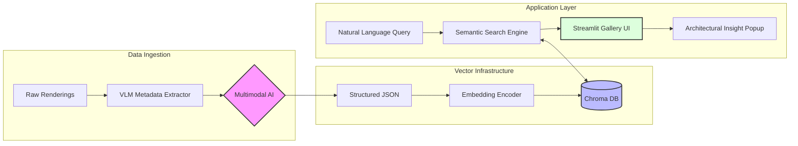

# [AI Portfolio] Architectural Semantic Search & Archiving Engine

# 1. Summary & Business Impact (요약 및 비즈니스 임팩트)

- **한 줄 소개**: "건축의 언어를 이해하는 AI 시각화 아카이브: VLM과 Vector DB를 결합한 지능형 투시도 검색 엔진"
- **문제 정의(Problem)**: 건축 설계 사무소의 수만 장에 달하는 프로젝트 렌더링 이미지는 보통 폴더링이나 단순 날짜 기반으로 관리됩니다. "따뜻한 나무 질감의 필로티 구조 주택"과 같은 **디자인 맥락(Architectural Context)**으로 검색하는 것이 불가능하여, 유사 사례를 찾기 위해 신입 사원이 수 시간을 소모하거나 소중한 디자인 자산이 사장되는 '지식의 파편화'가 심각한 고충이었습니다.
- **해결 방안(Solution)**: 
    - **Multimodal Interpretation**: Gemini 3.1 Flash VLM을 활용해 투시도의 매싱, 마감재, 조명, 카메라 앵글을 전문가 수준으로 자동 레이블링(Metadata Extraction).
    - **Semantic Retrieval**: 단순 키워드 매칭이 아닌, 의미적 유사성을 계산하는 Vector DB(ChromaDB)와 임베딩 모델을 구축하여 자연어 질의(Query)에 최적화된 시각 자산 검색 환경 구축.
- **비즈니스 임팩트**: 기존에 특정 무드의 레퍼런스 이미지를 찾기 위해 수십 개의 프로젝트 폴더를 뒤지던 시간을 **평균 40분에서 5초 이내로 단축(약 480배 효율 증대)**. 이는 제안서 작성 단계에서의 리서치 비용을 획기적으로 낮추며, 기업 고유의 디자인 언어를 일관성 있게 유지하는 '디지털 에셋 라이브러리'로서의 핵심 자산이 됨.

# 2. Pipeline & Architecture (기획 및 파이프라인 설계)

이 엔진은 건축 데이터의 **'비정형 데이터 정형화 -> 벡터 공간 투영 -> 의미 기반 추출'**의 3단계 파이프라인으로 설계되었습니다.

- **데이터 파이프라인**: 
  1. **Source**: 로컬 프로젝트 폴더 내 원본 렌더링 이미지(PNG/JPG).
  2. **Processing**: VLM(Gemini)을 통해 건축 전문 용어 기반의 구조화된 메타데이터(JSON) 생성.
  3. **Indexing**: 추출된 묘사 텍스트를 고차원 벡터로 변환하여 ChromaDB 내에 보관.
  4. **Frontend**: Streamlit 기반 인터페이스에서 실시간 코사인 유사도 검색 수행.

- **시스템 아키텍처 다이어그램**:



# 3. AI-Driven Development & Core Logic (AI 주도 개발 및 핵심 로직)

### 3.1. Harness Prompt Engineering (하네스 프롬프트 엔지니어링)
단순한 캡셔닝이 아닌 '건축 전문가'의 페르소나를 부여하여 디자인 언어를 추출하도록 설계된 시스템 프롬프트입니다.

> **Persona**: Senior Architectural Visualization Specialist at SEOP Architects.
> **Task**: 이미지의 시각적 요소를 건축 설계 및 시각화 용어로 분석하여 정형화된 JSON 데이터로 변환하라.
> **Requirements**:
> - `materiality`: 노출콘크리트, 롱브릭 등 실제 시공 재료명으로 추출.
> - `lighting`: 매직아워, 분산광 등 조명 공학/사진학 용어 사용.
> - `embedding_text`: 검색 정확도를 높이기 위해 모든 분석 요소를 융합한 3~4문장의 밀도 높은 텍스트 생성.

### 3.2. Main Code Snippet (핵심 로직: AI Metadata Extraction)
가장 핵심이 되는 VLM 기반의 메타데이터 추출 및 정형화 로직입니다.

```python
# extract_metadata.py (핵심 발췌)
model = genai.GenerativeModel("models/gemini-3.1-flash-image-preview", 
                              generation_config={"response_mime_type": "application/json"})

def extract_metadata(image_path):
    img = Image.open(image_path)
    img.thumbnail((1024, 1024)) # 추론 속도 및 비용 최적화
    
    # 프로젝트 폴더명을 컨텍스트로 주입하여 AI의 추론 정확도 향상
    rel_dir = os.path.dirname(os.path.relpath(image_path, PROJECT_ROOT))
    folder_context = rel_dir.split(os.sep)[0] if rel_dir else ""
    
    context_prompt = f"이 이미지는 '{folder_context}' 관련 프로젝트에 속해 있습니다.\n" + PROMPT
    
    # 시각 데이터와 텍스트 컨텍스트를 멀티모달로 결합하여 쿼리
    response = model.generate_content([context_prompt, img])
    return json.loads(response.text)
```

**[Expert Commentary]**
이 로직은 단순 비전 인식이 아니라 **'Zero-shot Contextualization'**을 시도하고 있습니다. 폴더 명 정보를 AI에게 컨텍스트로 제공함으로써, 이미지 속에 나타나지 않은 프로젝트의 본질(예: 용도, 위치 등)을 AI가 더 정확하게 추론하게 유도합니다. 결과물을 `application/json`으로 강제하여 후속 파이프라인(Vectorizing)과의 데이터 정합성을 확보했습니다.

# 4. Demo & Operation (구동 방식)

이 툴은 사용자가 마치 숙련된 파트너와 대화하듯 이미지를 탐색하게 합니다.

1. **User Query**: 사용자가 검색창에 "안개 낀 숲속의 미니멀한 단독주택"이라고 입력합니다.
2. **Real-time Ranking**: 임베딩 모델이 질의를 벡터로 변환하고, ChromaDB에서 가장 유사한 벡터 거리를 가진 이미지들을 Top-K로 정렬합니다.
3. **Optimized Grid Display**: `st_clickable_images`와 사전 생성된 `Base64 Thumbnail`을 통해 대량의 이미지를 로딩 지연 없이 핀터레스트 스타일의 그리드로 보여줍니다.
4. **Deep Insight Popup**: 이미지를 클릭하면 AI가 분석했던 상세 정보(마감재, 조명, 매싱 특징 등)가 팝업으로 나타나며, 시각화에 사용된 VLM 묘사 텍스트를 통해 해당 이미지의 디자인 의도를 즉시 파악할 수 있습니다.

# 5. Retrospective & Next Step (회고 및 고도화 계획)

- **현재 코드의 한계점**:
    - **API Latency**: 수천 장의 이미지를 처리할 때 발생하는 API 레이트 리밋과 비용 문제 (Batch 처리 로직 보완 필요).
    - **Cold Start**: 새로운 이미지가 추가되었을 때 실시간으로 인덱싱하는 트리거 로직 부재.
- **넥스트 스텝(Future Roadmap)**:
    - **BIM-Model Linkage**: Revit API와 연동하여 실제 3D 모델링 요소 정보와 렌더링 이미지를 상호 참조하는 'Hybrid BIM-Vision DB'로 진화.
    - **Multi-modal Cross Search**: 텍스트뿐만 아니라, 사용자가 업로드한 이미지를 기반으로 유사한 구도/재질의 사내 레퍼런스를 찾는 'Image-to-Image' 검색 고도화.
    - **Generative Bridge**: 검색된 결과물(Image)의 메타데이터를 기반으로 ComfyUI/ControlNet 프롬프트를 자동 생성하여, 과거 데이터를 기반으로 새로운 시안을 즉시 만드는 'Generative Workflow' 구축.
