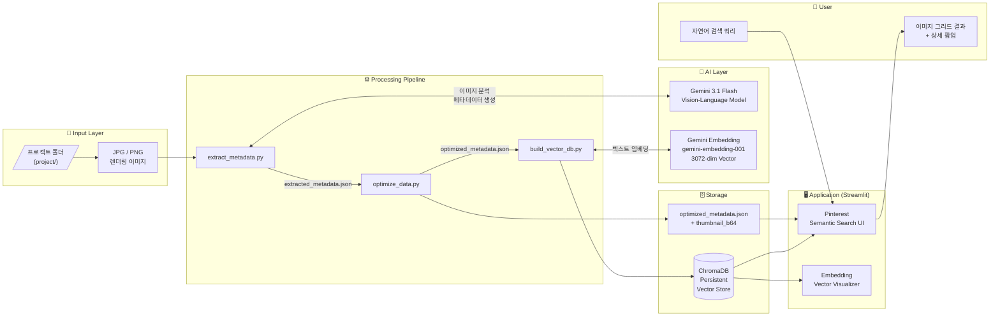

# SEOP Archive
### AI-Powered Design Intelligence Platform

<p align="center">
  
  
  
  
</p>

<br/>

> **" 건축가의 언어로 이미지를 검색한다 "**
>
> VLM(Vision-Language Model)과 Vector Database를 결합하여,
> 수백 장의 렌더링 자산을 *디자인 맥락* 그대로 단숨에 불러오는 지능형 아카이빙 시스템.

---

<br/>

## 01 &nbsp;— &nbsp;Why We Built This

건축 실무에서 가장 많은 시간을 잡아먹는 작업 중 하나는 **레퍼런스 이미지 탐색**입니다.

```
"그때 작업한 노출 콘크리트 느낌의 아이레벨 뷰가 어느 폴더에 있더라?"
"수변 공간이고, 황혼 무드였는데…"
```

파일명이나 날짜로는 절대 찾을 수 없는 질문들.
**SEOP Archive**는 이 문제를 AI로 해결합니다.

| Pain Point | Solution |
|:---|:---|
| 폴더 구조 기반 검색의 한계 | 이미지 의미(Semantic) 기반 자연어 검색 |
| 메타데이터 수작업 입력 | Gemini VLM이 건축 전문 용어로 자동 태깅 |
| 대용량 이미지 로딩 지연 | Base64 썸네일 사전 최적화로 즉시 렌더링 |
| 디자인 경향 파악 불가 | Embedding 시각화로 프로젝트군 클러스터 탐색 |

---

<br/>

## 02 &nbsp;— &nbsp;Key Features

### 🔍 Pinterest — Semantic Search
자연어 문장을 그대로 입력하면, AI가 의미적으로 유사한 이미지를 순위별로 반환합니다.
그리드 갤러리에서 이미지를 클릭하면 VLM이 분석한 상세 메타데이터 팝업이 열립니다.

### 🌌 Embedding — Vector Space Visualizer
226개 프로젝트 이미지의 High-Dimensional 임베딩 벡터를 PCA / t-SNE로 2D·3D 압축하여
어떤 이미지들이 의미적으로 가까운지 인터랙티브하게 탐색할 수 있습니다.

---

<br/>

## 03 &nbsp;— &nbsp;Pipeline & Architecture

### Data Pipeline — Input에서 Output까지

프로젝트 렌더링 이미지가 검색 결과로 출력되기까지의 전체 처리 흐름입니다.

```
📂 Raw Images (project/)
      │
      ▼
[ extract_metadata.py ]  ·····  Gemini 3.1 Flash (VLM)가 이미지를 보고
                                건축 전문 용어 기반 JSON 메타데이터를 생성합니다.
                                (카메라 구도, 형태, 마감재, 분위기, 키워드 등 8개 필드)
      │
      ▼  extracted_metadata.json
      │
[ optimize_data.py ]  ·········  각 이미지를 200px 썸네일로 리사이징하여
                                  Base64 문자열로 인코딩, JSON에 삽입합니다.
                                  (앱 로딩 시 파일 I/O 없이 즉시 렌더링)
      │
      ▼  optimized_metadata.json
      │
[ build_vector_db.py ]  ·······  embedding_text 필드를 Gemini Embedding 모델에 입력하여
                                  3072차원 벡터를 생성하고 ChromaDB에 Upsert합니다.
      │
      ▼  chroma_db/ (Persistent Vector Store)
      │
[ app.py / pages/ ]  ··········  사용자 쿼리 → 실시간 벡터 변환 → Cosine Similarity 검색
                                  → 결과 이미지 그리드 렌더링 + 상세 팝업
```

---

### System Architecture Diagram



---

<br/>

## 04 &nbsp;— &nbsp;Tech Stack

| Layer | Technology |
|:---|:---|
| **VLM / Vision AI** | `Google Gemini 3.1 Flash` (Image → Structured JSON) |
| **Embedding Model** | `gemini-embedding-001` (Text → 3072-dim Vector) |
| **Vector Database** | `ChromaDB` Persistent Client (Cosine Similarity) |
| **Frontend** | `Streamlit` Multipage App |
| **Visualization** | `Plotly` (Interactive 2D/3D Scatter) |
| **Dim. Reduction** | `PCA`, `t-SNE` (scikit-learn) |
| **Image Processing** | `Pillow`, `Base64` |
| **Language** | `Python 3.14` |

---

<br/>

## 05 &nbsp;— &nbsp;Project Structure

```
Embedding_Image/
│
├── app.py                    # Pinterest — Semantic Search 메인 앱
├── extract_metadata.py       # VLM 기반 메타데이터 추출 엔진
├── optimize_data.py          # 썸네일 Base64 최적화 스크립트
├── build_vector_db.py        # 벡터 임베딩 및 ChromaDB 인덱싱
│
├── pages/
│   └── 1_Embedding.py        # Embedding — Vector Space Visualizer
│
├── extracted_metadata.json   # VLM 분석 결과 원본 (226 items)
├── optimized_metadata.json   # 썸네일 포함 최적화 데이터 (226 items)
│
├── chroma_db/                # ChromaDB 영구 벡터 저장소
│   └── chroma.sqlite3
│
└── project/                  # 원본 렌더링 자산 (Git 제외)
```

---

<br/>

## 06 &nbsp;— &nbsp;Getting Started

**Step 1. 환경 설치**
```bash
pip install -r requirements.txt
```

**Step 2. 데이터 파이프라인 실행** *(신규 이미지 추가 시)*
```bash
py extract_metadata.py    # VLM 메타데이터 추출
py optimize_data.py       # 썸네일 Base64 최적화
py build_vector_db.py     # 벡터 DB 구축
```

**Step 3. 앱 실행**
```bash
py -m streamlit run app.py
```

---

<br/>

## 07 &nbsp;— &nbsp;Author

**SEOP Architects &nbsp;|&nbsp; AI Product Division**

- Domain &nbsp;·&nbsp; Architecture, Engineering, Construction (AEC)
- Mission &nbsp;·&nbsp; AI-Integrated Design Process & Knowledge Management

---

<p align="right"><sub>README last updated: 2026.04</sub></p>
