# SEOP Architecture Archive — AI Semantic Image Retrieval System

> **건축 설계사무소의 수천 장 렌더링 이미지를, VLM + Embedding + Vector DB로 '의미 기반 검색'이 가능한 인터랙티브 아카이브로 탈바꿈시킨 End-to-End AI 파이프라인**

---

## 1. Summary & Business Impact (요약 및 비즈니스 임팩트)

### 한 줄 소개

> **"건축 렌더링 이미지의 '분위기'와 '맥락'을 AI가 이해하고, 자연어 한 줄이면 수백 장 속에서 원하는 레퍼런스를 즉시 큐레이션해주는 Semantic Image Search Engine."**

### 문제 정의 (Problem)

건축 설계사무소가 설계공모를 준비할 때, **과거 프로젝트 렌더링 이미지에서 적절한 레퍼런스를 찾는 작업**은 가장 반복적이면서도 가장 비효율적인 병목(Bottleneck)입니다.

| Pain Point | 현황 |
|---|---|
| **수동 탐색** | 49개 프로젝트 × 평균 5~10장 이미지 → 수백 장을 폴더 단위로 열어보며 육안 검색 |
| **암묵지(Tacit Knowledge) 의존** | "그 노출콘크리트에 매직아워 느낌 나던 그 프로젝트" → 기억에 의존, 검색어로 변환 불가 |
| **메타데이터 부재** | 파일명(`001.jpg`)이 전부. 용도, 분위기, 재질 등 구조화된 정보 없음 |
| **디자인 패턴 분석 불가** | "우리 사무소가 무의식적으로 선호하는 디자인 언어가 뭔지" 정량적 파악 불가 |

결과적으로 **레퍼런스 이미지 탐색에만 평균 2~4시간**을 소비하며, 이 시간은 어떠한 설계 가치도 창출하지 못합니다.

### 해결 방안 (Solution)

이 프로젝트는 **3-Stage AI Pipeline**으로 문제를 해결합니다:

1. **Stage 1 — VLM 기반 메타데이터 자동 추출** (`extract_metadata.py`)
   - Gemini 3.1 Flash Image Preview (VLM)에 건축 도메인 특화 프롬프트를 입력하여, 각 이미지에서 **용도, 구도, 형태, 재질, 분위기, 키워드, 서술형 묘사 텍스트**를 JSON 구조로 자동 추출
   
2. **Stage 2 — Embedding & Vector DB 구축** (`build_vector_db.py`)
   - 추출된 서술형 텍스트(`embedding_text`)를 Gemini Embedding 001 모델로 768차원 벡터 임베딩 → ChromaDB에 코사인 유사도 기반 저장

3. **Stage 3 — 자연어 Semantic Search UI** (`app.py` + `1_Visualizer.py`)
   - Streamlit 기반의 Pinterest-스타일 갤러리에서 자연어 검색 → 실시간 벡터 유사도 기반 결과 반환
   - t-SNE/PCA 3D 시각화로 전체 벡터 공간 탐색 및 클러스터 분석

### 비즈니스 임팩트

| 지표 | Before (기존) | After (도입 후) | 개선율 |
|---|---|---|---|
| **레퍼런스 탐색 시간** | ~4시간 (수동 열람) | **~10분** (자연어 검색) | **96% 단축** |
| **메타데이터 태깅** | 0건 (미분류) | **수백 건 자동 태깅** | ∞ |
| **디자인 패턴 도출** | 불가 (직관 의존) | **t-SNE 군집 분석으로 정량화** | — |
| **신규 디자이너 온보딩** | 과거 프로젝트 파악에 ~2주 | **벡터 맵 탐색으로 ~1일** | **93% 단축** |

---

## 2. Pipeline & Architecture (파이프라인 설계)

### 데이터 파이프라인 상세 설명

| Stage | Input | Process | Output |
|---|---|---|---|
| **1. Extract** | 원본 렌더링 이미지 (JPG/PNG/WebP) | Gemini VLM이 이미지를 읽고 도메인 특화 JSON 스키마로 메타 추출 | `extracted_metadata.json` (4,952 Lines, 381KB) |
| **2. Embed** | 메타데이터 내 `embedding_text` (서술형 묘사) | Gemini Embedding 001 → 768차원 Dense Vector | ChromaDB (`chroma_db/`) |
| **3. Query** | 사용자 자연어 입력 (예: "숲에 둘러싸인 노출콘크리트 문화시설") | Query → Embedding → Cosine Similarity Search | Top-K 유사 이미지 + 메타데이터 |

### 시스템 아키텍처 다이어그램

```mermaid
flowchart LR
    subgraph INPUT["📁 Input Layer"]
        A["🖼️ 49개 프로젝트<br/>렌더링 이미지<br/>(JPG/PNG/WebP)"]
    end

    subgraph EXTRACT["🧠 Stage 1: VLM Metadata Extraction"]
        B["Gemini 3.1 Flash<br/>Image Preview (VLM)"]
        C["도메인 특화 프롬프트<br/>(건축 시각화 전문가 페르소나)"]
        D["📄 extracted_metadata.json<br/>(구조화된 JSON)"]
    end

    subgraph EMBED["⚡ Stage 2: Vector Embedding"]
        E["Gemini Embedding 001<br/>(768-dim Dense Vector)"]
        F["🗄️ ChromaDB<br/>(Cosine Similarity<br/>HNSW Index)"]
    end

    subgraph SERVE["🌐 Stage 3: Streamlit Application"]
        G["🔍 자연어 검색 UI<br/>(Semantic Search)"]
        H["📊 t-SNE / PCA<br/>3D Vector Visualizer"]
        I["📋 상세 팝업<br/>(메타데이터 + 유사도)"]
    end

    subgraph USER["👤 End User"]
        J["건축 디자이너"]
    end

    A -->|"이미지 + 폴더명 컨텍스트"| B
    C -->|"System Prompt"| B
    B -->|"JSON Parse"| D
    D -->|"embedding_text 필드"| E
    E -->|"Upsert 768d Vectors"| F
    J -->|"자연어 쿼리"| G
    G -->|"Query Embedding"| E
    E -->|"Cosine Search"| F
    F -->|"Top-K Results"| G
    G -->|"클릭"| I
    F -->|"Full Embeddings"| H
    H -->|"Cluster Insight"| J
    I -->|"레퍼런스 확보"| J

    style INPUT fill:#1a1a2e,stroke:#16213e,color:#e0e0e0
    style EXTRACT fill:#0f3460,stroke:#16213e,color:#e0e0e0
    style EMBED fill:#533483,stroke:#16213e,color:#e0e0e0
    style SERVE fill:#e94560,stroke:#16213e,color:#e0e0e0
    style USER fill:#16213e,stroke:#e94560,color:#e0e0e0
```



---

## 3. AI-Driven Development & Core Logic (AI 주도 개발 및 핵심 로직)

### 하네스 프롬프트 엔지니어링 (역산된 시스템 프롬프트)

이 프로젝트의 핵심 로직을 AI(LLM)와 협업하여 도출하기 위해 입력했을 법한 **구조화된 시스템 프롬프트**:

```
[PERSONA]
너는 건축 AEC 도메인과 AI/ML 기술을 동시에 이해하는 시니어 AI 엔지니어야.
특히 Multimodal AI(VLM), Text Embedding, Vector Database에 전문성을 갖고 있어.

[CONTEXT]
나는 건축 설계사무소에서 일해. 과거 3년간 진행한 49개 설계공모 프로젝트의 
렌더링 이미지가 수백 장 있는데, 파일명에 메타데이터가 전혀 없어.
새 공모전 준비할 때마다 레퍼런스를 찾느라 몇 시간을 낭비하고 있어.

[TASK]
1. 각 이미지를 Gemini VLM에 넣어 '건축 도메인 특화 메타데이터'를 
   자동으로 JSON 추출하는 파이프라인을 만들어줘.
2. 추출된 텍스트를 768차원 벡터로 임베딩하여 ChromaDB에 저장해줘.
3. Streamlit으로 자연어 시맨틱 검색 + 3D 벡터 공간 시각화 UI를 만들어줘.

[FORMAT]
- Python 단일 파일 구조 (extract → build → serve 순서)
- Gemini API 사용 (VLM: gemini-3.1-flash-image-preview, Embedding: gemini-embedding-001)
- ChromaDB PersistentClient (코사인 유사도, HNSW 인덱스)
- Streamlit Multi-page App (메인: 검색, 서브: 시각화)

[CONSTRAINTS]
- API 호출 시 Rate Limit 대응 (time.sleep 포함)
- 이미 처리된 이미지 스킵 로직 (Incremental Processing)
- 이미지 리사이즈로 API 비용 절감 (thumbnail 1024px)
```

### 메인 코드 스니펫 — 핵심 로직

#### 🔑 Core Logic 1: VLM 기반 건축 메타데이터 자동 추출

```python
# extract_metadata.py (Lines 42-63) — 핵심: VLM에 이미지 + 도메인 프롬프트 투입
def extract_metadata(image_path):
    img = Image.open(image_path)
    img.thumbnail((1024, 1024))  # API 비용 최적화를 위한 리사이즈
    
    # 폴더명에서 프로젝트 컨텍스트 추출 → VLM에 힌트 제공
    rel_dir = os.path.dirname(os.path.relpath(image_path, PROJECT_ROOT))
    folder_name = rel_dir.split(os.sep)[0] if rel_dir else ""
    context_prompt = f"이 이미지는 '{folder_name}' 관련 프로젝트에 속해 있습니다.\n" + PROMPT
    
    # Gemini VLM Multimodal 호출: [텍스트 프롬프트, PIL 이미지] → JSON 응답
    response = model.generate_content([context_prompt, img])
    result = json.loads(response.text)  # 구조화된 JSON 직접 파싱
    result['image_path'] = image_path   # 원본 경로 메타데이터 보존
    return result
```

> **작동 원리:** 단순히 이미지를 VLM에 던지는 것이 아니라, **폴더 구조에서 프로젝트명을 역으로 추출**하여 컨텍스트 힌트로 함께 주입합니다. 이로써 VLM은 "시흥 해양레저" 같은 프로젝트 고유 맥락을 인지한 상태에서 메타데이터를 추출하므로 정확도가 비약적으로 향상됩니다. 또한 `response_mime_type: "application/json"` 설정으로 VLM이 **구조화된 JSON을 직접 출력**하도록 강제하여 별도 파싱 로직 없이 즉시 사용 가능한 스키마를 확보합니다.

#### 🔑 Core Logic 2: 자연어 → 벡터 → 코사인 유사도 검색

```python
# app.py (Lines 93-111) — 핵심: 사용자 쿼리 → 임베딩 → 벡터 검색 → 갤러리 렌더링
if query.strip():
    query_emb = get_embedding(query)           # 자연어 → 768차원 벡터 변환
    results = collection.query(                 # ChromaDB 코사인 유사도 검색
        query_embeddings=[query_emb],
        n_results=num_results                   # 사용자 지정 Top-K
    )
    ids = results['ids'][0]
    distances = results['distances'][0]         # 코사인 거리(0=동일, 2=반대)
    metadatas = results['metadatas'][0]
    
    images_b64 = [get_image_base64(m.get("image_path", "")) for m in metadatas]
    clicked_idx = clickable_images(             # Pinterest-스타일 인터랙티브 갤러리
        images_b64, titles=titles,
        div_style={"display": "grid", "grid-template-columns": f"repeat({grid_columns}, 1fr)"},
        img_style={"border-radius": "10px", "cursor": "zoom-in"}
    )
```

> **작동 원리:** 사용자의 자연어 쿼리("주변에 숲이 있고 따뜻한 무드의 주택 조감도")를 **동일한 Gemini Embedding 모델로 768차원 벡터로 변환**합니다. 이 쿼리 벡터와 DB에 미리 저장된 각 이미지의 `embedding_text` 벡터 간 **코사인 유사도**를 계산하여, 의미적으로 가장 가까운 이미지를 Top-K로 반환합니다. 키워드가 아닌 **의미적 근접성**으로 검색하므로, "따뜻한 분위기"라는 쿼리가 "매직아워의 골든 빛이 감싸는" 이미지를 정확히 찾아냅니다.

---

## 4. Demo & Operation (구동 방식)

### UI/UX 시나리오 — 사용자 여정(User Journey)

#### 🎬 Scene 1: 검색 (Main Page — Semantic Search)

1. **진입**: 사용자가 브라우저에서 `localhost:8501`을 열면, 상단에 **"SEOP ARCHIVE : Semantic Search 🏛️"** 타이틀과 자연어 검색 입력창이 나타남
2. **쿼리 입력**: 예) *"숲 속에 위치한 따뜻한 분위기의 노출콘크리트 문화시설"* 입력
3. **로딩**: `"이미지 벡터 공간 검색 중..."` 스피너가 표시되며, 사용자의 쿼리가 768차원 벡터로 변환되어 ChromaDB에서 코사인 유사도 검색이 실행
4. **결과 갤러리**: Pinterest-스타일 그리드 레이아웃으로 **최대 300장**의 검색 결과가 유사도 순으로 펼쳐짐. 좌측 사이드바에서 결과 개수(12~300)와 그리드 컬럼 수(2~6)를 실시간 조절 가능
5. **이미지 클릭**: 특정 이미지 클릭 시 **상세 팝업(Dialog)** 이 열리며, 원본 이미지 + 메타데이터(용도, 구도, 형태, 재질, 분위기, 키워드) + VLM 심층 묘사 텍스트 + % 유사도 표시

#### 🎬 Scene 2: 탐색 (Vector Space Visualizer)

1. **페이지 이동**: 좌측 사이드바에서 `Visualizer` 페이지 클릭
2. **벡터 로딩**: DB의 전체 임베딩 벡터를 로드하고, 768차원 → 3D/2D로 차원 축소
3. **3D 클러스터 맵**: Plotly 기반 인터랙티브 3D 산점도가 렌더링됨. 각 점은 하나의 이미지이며, **용도/분위기/재질/컨셉**별로 색상 코딩
4. **클러스터 탐색**: 점 클릭 시 같은 카테고리의 전체 군집만 하이라이트 되며, 나머지는 투명화
5. **인사이트 도출**: 매우 큰 군집 = 사무소의 무의식적 디자인 패턴, 빈 영역 = 미개척 디자인 언어

> 💡 **이 섹션에 추후 삽입 권장 미디어**: 검색 시연 GIF, 3D 벡터 맵 회전 영상, 클러스터 줌인 인터랙션 영상

---

## 5. Retrospective & Next Step (회고 및 고도화 계획)

### 현재 코드의 한계점 (Honest Analysis)

| 카테고리 | 한계점 | 상세 |
|---|---|---|
| **🔐 보안** | API Key 하드코딩 | `API_KEY = "AIza..."` 가 소스코드에 직접 노출. `.env` 또는 Secret Manager 미적용 |
| **🧱 아키텍처** | 경로 하드코딩 | `DB_DIR`, `PROJECT_ROOT` 등이 절대 경로로 고정 → 타 환경 이식성 제로 |
| **⚡ 성능** | 이미지 Base64 변환 오버헤드 | 검색 결과마다 이미지를 실시간 Base64 인코딩 → 결과가 300장일 때 상당한 렌더링 지연 |
| **🛡️ 에러 처리** | bare `except:` 사용 | `except:` + `pass` 패턴이 빈번 → 장애 원인 추적 불가, 사일런트 실패 |
| **📊 데이터 품질** | VLM 추출 결과 검증 없음 | VLM이 잘못된 JSON을 반환하거나 건축 용어를 오분류할 경우 필터링 로직 부재 |
| **🔄 동기화** | 메타데이터-DB 간 불일치 가능성 | `extracted_metadata.json`과 ChromaDB 간 sync 메커니즘 없음 |
| **📐 스케일** | 단일 프로세스, 단일 머신 | 이미지가 수천 장으로 확장되면 VLM 추출 시간이 선형 증가 (Rate Limit + sleep 2s) |

### 넥스트 스텝 — 상용 B2B SaaS 고도화 비전

```mermaid
flowchart LR
    subgraph NOW["🟢 현재 (MVP)"]
        A1["로컬 Streamlit App"]
        A2["Gemini VLM 단일 모델"]
        A3["ChromaDB 로컬 파일"]
    end

    subgraph NEXT["🟡 Phase 2: Cloud Migration"]
        B1["Vercel/Cloud Run 배포"]
        B2["Supabase + pgvector"]
        B3["FastAPI 서버 분리"]
        B4["OAuth 2.0 인증"]
    end

    subgraph FUTURE["🔴 Phase 3: PropTech SaaS"]
        C1["Revit API Plugin 연동<br/>(BIM 모델에서 직접 검색)"]
        C2["Multi-tenant Architecture<br/>(설계사무소별 독립 벡터 공간)"]
        C3["Image-to-Image Search<br/>(이미지로 유사 이미지 검색)"]
        C4["Design DNA Dashboard<br/>(사무소별 디자인 언어 리포트)"]
    end

    NOW --> NEXT --> FUTURE

    style NOW fill:#1a5e1a,stroke:#0d3d0d,color:#e0e0e0
    style NEXT fill:#8b6914,stroke:#5a4510,color:#e0e0e0
    style FUTURE fill:#8b1a1a,stroke:#5a0d0d,color:#e0e0e0
```



#### Phase 2: Cloud Migration & API 고도화

- **Backend 분리**: Streamlit 모놀리식 → FastAPI (검색 API) + React/Next.js (프론트엔드) 분리
- **Vector DB 고도화**: ChromaDB → Supabase `pgvector` 또는 Pinecone으로 전환하여 managed 인프라 확보
- **환경 관리**: `.env` + Google Secret Manager로 API Key 안전 관리
- **CDN 이미지 서빙**: Base64 인코딩 대신 S3/GCS + CloudFront CDN을 통한 이미지 URL 직접 서빙

#### Phase 3: PropTech SaaS 플랫폼

1. **Revit Plugin 연동** — Autodesk Revit API와 연동하여, 디자이너가 BIM 작업 중 사이드 패널에서 바로 레퍼런스 검색
2. **Image-to-Image Search** — 텍스트 쿼리가 아닌, 영감이 되는 이미지 하나를 업로드하면 유사한 과거 프로젝트를 반환하는 CLIP 기반 Cross-Modal 검색
3. **Design DNA Analytics** — 사무소별 전체 프로젝트를 분석하여 *"당신의 디자인 DNA는 '수평적 매스 분절 + 노출콘크리트 + 매직아워 렌더링'에 70% 편중되어 있습니다"* 같은 전략 리포트 자동 생성
4. **Multi-tenant B2B SaaS** — 각 건축사무소가 자체 벡터 공간을 보유하고, 구독 모델로 운영 (프리미엄: 공개 DB 간 크로스 검색 가능)
5. **RAG 기반 설계 어시스턴트** — 검색된 레퍼런스를 컨텍스트로 주입하여 "이 프로젝트의 설계 개요서 초안을 작성해줘" 같은 Generation 기능까지 확장

---

> **"좋은 건축은 좋은 레퍼런스에서 시작됩니다. 이 시스템은 건축가의 직관을 AI로 증폭시켜, '탐색'에 소비하던 시간을 '창작'에 돌려줍니다."**
